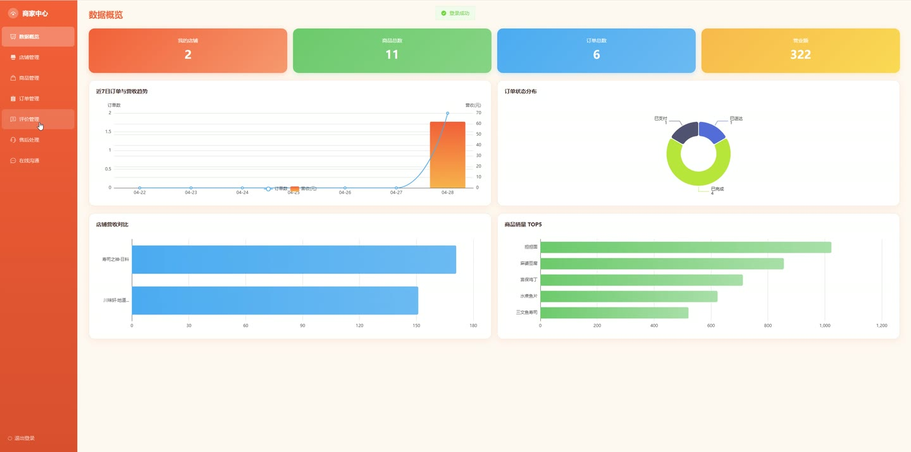
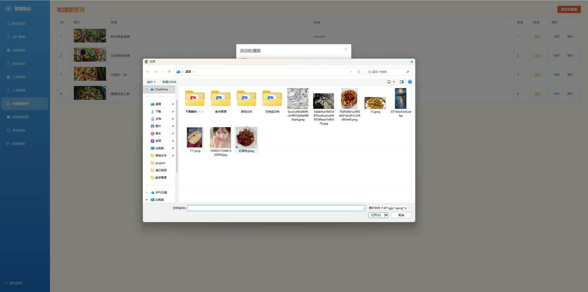
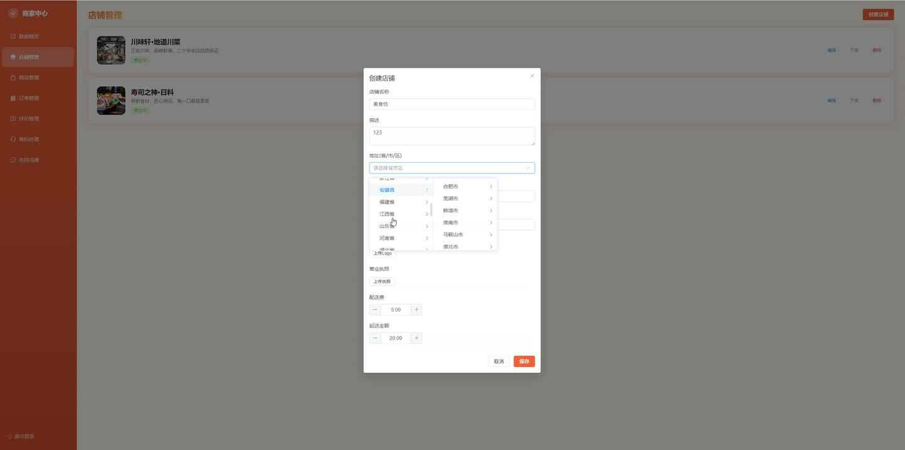
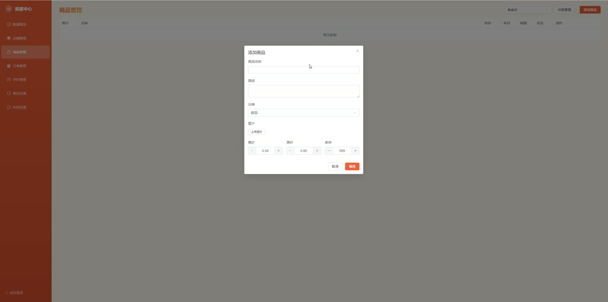
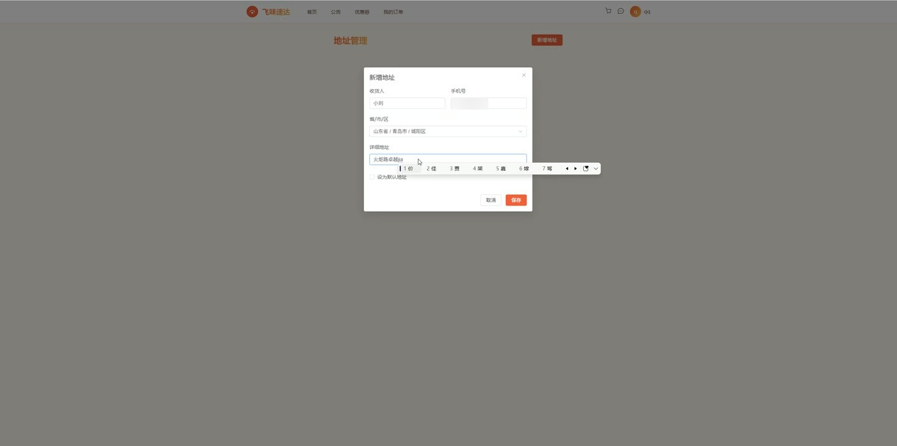

# (附文档)Springboot3+Vue3+MySQL 外卖配送平台系统

**技术栈**：Springboot3、Vue3、MySQL

### 系统简介

本系统是一套基于 Spring Boot 3 + Vue 3 + MySQL 构建的外卖配送平台，采用前后端分离架构。系统支持普通用户、商家、骑手、管理员四种角色，覆盖外卖从下单、支付、接单、配送、完成到售后评价的全链路流程，并提供数据统计看板、优惠券、消息、地址管理等配套功能。
 
### 核心功能
 
### 普通用户端

 
- 注册/登录：通过用户名密码注册新账号，登录后获取 JWT Token 用于后续鉴权。 
- 浏览店铺：查看已审核通过的店铺列表，支持按店铺名称关键词搜索，按月销量排序。 
- 浏览商品：进入店铺后查看上架商品列表，支持按商品分类筛选，按销量排序。 
- 搜索商品：输入关键词搜索商品名称或描述，结果仅展示状态为"上架"的商品。 
- 管理收货地址：新增、编辑、删除收货地址，支持设置默认地址（每次设置默认时自动取消其他默认）。 
- 购物车管理：将商品加入购物车（同一店铺同一商品累加数量），修改数量、删除购物项、清空购物车。 
- 下单结算：从购物车生成订单，填写收货地址、电话、收件人姓名、备注，自动计算商品总价 + 配送费。 
- 查看订单：按状态筛选我的订单列表（待支付/已支付/已接单/配送中/已完成/已取消），查看订单详情及商品明细。 
- 支付订单：对待支付订单执行支付操作（模拟），更新订单状态为"已支付"。 
- 取消订单：对未完成的订单执行取消操作。 
- 评价订单：对已完成订单提交评价（评分 + 内容），查看商家回复。 
- 领取优惠券：查看可用优惠券列表，领取优惠券（每人限领一张），查看已领取的优惠券及使用状态。 
- 发起售后：对订单提交售后申请，填写售后原因，查看售后处理进度。 
- 消息聊天：与商家/骑手进行实时聊天，查看聊天记录、未读消息数、会话列表。 
- 个人信息管理：修改昵称、手机号、邮箱、头像，修改登录密码（需验证旧密码）。 
- 查看公告：浏览系统发布的公告列表。
 
### 商家端

 
- 店铺管理：申请开店（填写店铺名称、地址、配送费等信息，状态为"待审核"），编辑店铺信息。 
- 商品管理：新增商品（填写名称、图片、价格、库存、所属分类），编辑、下架、删除商品。 
- 商品分类管理：为店铺创建/编辑/删除商品分类，支持排序。 
- 订单管理：查看本店铺的订单列表（支持按状态筛选），接单（将"已支付"订单改为"已接单"），标记备餐完成（改为"已备好"）。 
- 评价管理：查看本店铺收到的用户评价，对评价进行回复。 
- 售后处理：查看本店铺的售后申请列表，处理售后（同意/拒绝）。 
- 数据统计：查看店铺总订单数、商品总数、总收入、今日订单数等概览数据。 
- 统计图表：查看近7天订单趋势（订单量/收入）、订单状态分布、各店铺收入对比、销量 Top 5 商品。 
- 消息聊天：与用户/骑手聊天，查看会话列表。
 
### 骑手端

 
- 接单配送：查看可接单的订单（状态为"已接单"或"已备好"），接单配送（更新订单状态为"配送中"）。 
- 完成配送：将配送中的订单标记为"已完成"。 
- 位置上报：实时上报骑手当前位置（经纬度），系统记录最新位置。 
- 查看位置：查看指定骑手的当前位置。 
- 数据统计：查看今日配送单数、配送中订单数、已完成订单数、总配送单数、总配送收入。 
- 统计图表：查看近7天配送趋势（订单量/收入）、订单状态分布、配送时段分布。 
- 消息聊天：与用户/商家聊天，查看会话列表。
 
### 管理员端

 
- 用户管理：查看所有用户列表，按角色（用户/商家/骑手）筛选，按用户名/昵称/手机号搜索，启用或禁用账号。 
- 店铺审核：查看所有店铺列表，审核新注册店铺（通过/驳回），管理店铺状态。 
- 商品审核：查看所有商品列表，审核新上架商品（通过/驳回）。 
- 订单管理：查看平台所有订单，按状态筛选，查看订单详情。 
- 售后管理：查看所有售后申请列表，按状态筛选，处理售后。 
- 优惠券管理：创建/编辑/删除优惠券（设置面额、满减条件、库存、状态），查看优惠券列表。 
- 公告管理：发布/编辑/删除系统公告，公告列表按时间倒序展示。 
- 轮播图管理：添加/编辑/删除首页轮播图，设置排序和启用状态。 
- 数据总览：查看平台用户数（按角色）、店铺数、商品数、订单数、总收入、待审核店铺数。 
- 统计图表：查看近7天平台订单趋势（订单量/收入）、订单状态分布、订单量 Top 5 店铺。 
- 数据库备份：创建 MySQL 数据库备份，查看备份文件列表（大小/时间），下载备份文件，删除备份文件。
 
### 技术栈

 后端框架Spring Boot 3.x ORMMyBatis-Plus 权限认证JWT（jjwt） 密码加密BCrypt（PasswordUtil） 前端框架Vue 3 状态管理Pinia 前端路由Vue Router 构建工具Vite 数据库MySQL HTTP 客户端Axios
 
### 交付内容

 
- 后端完整源码 
- 前端完整源码 
- 数据库初始化脚本 
- 万字文档

## 界面展示

---

## 获取完整源码 + 万字文档

本仓库为项目介绍页。**完整前后端源码、数据库初始化脚本、万字项目文档**，请加微信 `kangkangcode`，或访问 [codekk.top](http://codekk.top) 获取。

可作课程设计 / 毕业设计参考，支持远程部署调试。